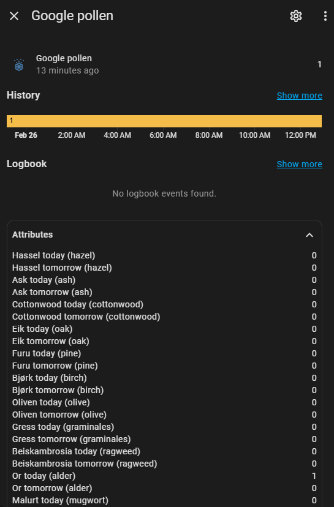

# Home Assistant Google Pollen

A Home Assistant custom component to fetch pollen data from the Google Pollen API. 



## Installation

### HACS (Home Assistant Community Store)

1. Ensure that you have [HACS](https://hacs.xyz/) installed in your Home Assistant setup.
2. Add this repository to HACS:
    - Go to HACS > Integrations.
    - Click on the three dots in the top right corner and select "Custom repositories".
    - Add the repository URL: `https://github.com/svenove/home-assistant-google-pollen`.
3. Find "Google Pollen" in the HACS store and click "Install".

### Manual Installation

1. Download the `custom_components` folder from this repository.
2. Copy the `google_pollen` directory into your Home Assistant's `custom_components` directory.
3. Restart Home Assistant.

## Configuration

Add the following to your `configuration.yaml` file:

```yaml
sensor:
  - platform: google_pollen
    api_key: YOUR_API_KEY
    latitude: YOUR_LATITUDE
    longitude: YOUR_LONGITUDE
    name: Custom Sensor Name (Optional)
    language: en (Optional)
```

- `api_key`: Your API key for the Google Pollen API.
- `latitude`: Latitude of the location you want to monitor.
- `longitude`: Longitude of the location you want to monitor.
- `name`: (Optional) Custom name for the sensor (default is "Google pollen").
- `language`: (Optional) Language code for the data (default is `en`).

## Obtaining Google Pollen API Key

To obtain an API key for the Google Pollen API, follow these steps:

1. Go to the [Google Cloud Console](https://console.cloud.google.com/).
2. Create a new project or select an existing project.
3. Navigate to the [API & Services](https://console.cloud.google.com/apis/dashboard) dashboard.
4. Click on "Enable APIs and Services".
5. Search for "Pollen API" and enable it.
6. Go to the "Credentials" tab on the left sidebar.
7. Click on "Create credentials" and select "API key".
8. Copy the generated API key and use it in the `api_key` field in your `configuration.yaml` file.

## Usage

### Entity Attributes

The sensor provides various attributes for different pollen types. 
The attribute names are set according to the language configured in configuration.yaml.

The state of the sensor represents the highest pollen value for the current day.

## License

This project is licensed under the MIT License.

## Terms of use and privacy policy
You are bound by Google’s [Terms of Service](http://www.google.com/intl/en/policies/terms) and [Terms of Use](https://cloud.google.com/maps-platform/terms/).

This custom component uses the Google Maps API, see [Google Privacy Policy](https://www.google.com/policies/privacy/).


